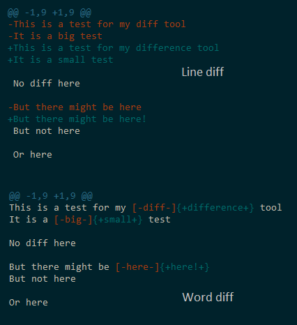

# git-diff

<br>[](https://travis-ci.org/danday74/git-diff)
[](https://ci.appveyor.com/project/danday74/git-diff)
[](https://coveralls.io/github/danday74/git-diff)
<br>[](https://www.npmjs.com/package/git-diff)
[](https://david-dm.org/danday74/git-diff)
[](https://www.npmjs.com/package/git-diff)
[](https://www.npmjs.com/package/git-diff)

**Returns the git diff of two strings**


<br>

## Introduction

git-diff will use ```git``` (if installed) and ```printf``` (if available) to get the real git diff of two strings.

If either command is unavailable, git-diff instead returns a very good fake git diff.


<br>

## Usage

`npm install --save git-diff`

git-diff takes 3 arguments, the **old string** to diff, the **new string** to diff and optionally an [options object](#options-object)

git-diff returns the git diff or `undefined` where there is no difference.

String diff example:

```javascript 1.5
var gitDiff = require('git-diff')
var oldStr = 'fred\nis\nfunny\n'
var newStr = 'paul\nis\nfunny\n'
var actual = gitDiff(oldStr, newStr)
expect(actual).to.equal('@@ -1,3 +1,3 @@\n-fred\n+paul\n is\n funny\n')
```

File diff example:

```javascript 1.5
var gitDiff = require('git-diff')
var readFileGo = require('readfile-go') // or your preferred file reader
var oldStr = readFileGo(__dirname + '/oldStr.txt')
var newStr = readFileGo(__dirname + '/newStr.txt')
var actual = gitDiff(oldStr, newStr)
```


<br>

## Options object

Available options are:

color | flags | forceFake | noHeaders | save | wordDiff

Default options are:

```javascript 1.5
var options = {
  color: false,      // Add color to the git diff returned?
  flags: null,       // A space separated string of git diff flags from https://git-scm.com/docs/git-diff#_options
  forceFake: false,  // Do not try and get a real git diff, just get me a fake? Faster but may not be 100% accurate
  noHeaders: false,  // Remove the ugly @@ -1,3 +1,3 @@ header?
  save: false,       // Remember the options for next time?
  wordDiff: false    // Get a word diff instead of a line diff?
}
```

Where options are not self explanatory, further assistance is given below.


<br>

#### **flags** (string | null) [](#options-object)

The flags option allows you to use any [git diff flags](https://git-scm.com/docs/git-diff#_options)

It only applies to real git diffs and will not effect the returned git diff if it is fake.

An example to illustrate:

```javascript 1.5
var gitDiff = require('git-diff')
var oldStr = 'fred\n   is   \nfunny\n'
var newStr = 'paul\nis\n   funny   \n'
var actual = gitDiff(oldStr, newStr, {flags: '--diff-algorithm=minimal --ignore-all-space'})
expect(actual).to.equal('@@ -1,3 +1,3 @@\n-fred\n+paul\n is\n    funny   \n')
```


<br>

#### **forceFake** (boolean) [](#options-object)

git-diff will first try to use ```git``` and ```printf``` to get the real git diff of two strings.

If it cannot, it instead returns a very good fake git diff.

A fake git diff is faster to obtain but may not be 100% representative of a real git diff.

The [flags](TODO) option is unavailable when faking and fake diffs never have a header.

However, if a fake is good enough and speed is of the essence then you may want to force a fake git diff.

The forceFake option allows you to do exactly that:

```javascript 1.5
var gitDiff = require('git-diff')
var oldStr = 'fred\nis\nfunny\n'
var newStr = 'paul\nis\nfunny\n'
var actual = gitDiff(oldStr, newStr, {forceFake: true})
expect(actual).to.equal('-fred\n+paul\n is\n funny\n')
```


<br>

#### **save** (boolean) [](#options-object)

Its annoying to keep passing the same options every time.

git-diff, if instructed to do so, will remember previously used options for you.

When the `{save: true}` option is used in a call to git-diff subsequent calls remember the options.

```javascript 1.5
var gitDiff = require('git-diff')
var oldStr = 'fred\nis\nfunny\n'
var newStr = 'paul\nis\nfunny\n'
var actual

actual = gitDiff(oldStr, newStr, {save: true, wordDiff: true})
expect(actual).to.equal('@@ -1,3 +1,3 @@\n[-fred-]{+paul+}\nis\nfunny\n')
actual = gitDiff(oldStr, newStr)
expect(actual).to.equal('@@ -1,3 +1,3 @@\n[-fred-]{+paul+}\nis\nfunny\n')
```

Here, the second call remembers that the color option is off and wordDiff is on. `{color: false}` and `{wordDiff: true}` are now the defaults.


<br>

#### **wordDiff** (boolean) [](#options-object)

This option allows you to choose between a line diff `{wordDiff: false}` and a word diff `{wordDiff: true}`

console.logging the returned git-diff for both a line diff and a word diff produces:




<br>

## FAQs

Q: What is a real git diff?

A: A real git diff refers to the actual diff output produced by git itself

Q: What is a fake git diff?

A: A fake git diff is a programmatic attempt to reproduce / mimic the diff output produced by git

Q: How can I tell if the returned git diff is real or fake?

A: If the @@ -1,3 +1,3 @@ header is present then the returned git diff is real
   If the header is absent then either the noHeaders option is on or the returned git diff is fake

Q: Will my environment produce real or fake git diffs?

A: Linux and mac have the ```printf``` command available. On Windows [git bash](https://git-for-windows.github.io) makes ```printf``` available.

   Where git is installed then any of these environments will produce a real git diff.


<br>

## Asynchronous execution

git-diff exposes a promise based asynchronous solution:

```javascript 1.5
var gitDiff = require('git-diff/async')
var oldStr = 'fred\nis\nfunny\n'
var newStr = 'paul\nis\nfunny\n'
gitDiff(oldStr, newStr).then(function(actual) {
  expect(actual).to.equal('@@ -1,3 +1,3 @@\n-fred\n+paul\n is\n funny\n')
})
```


<br>

## Author says

What's the **difference** between how God treats the righteous and the wicked?

> And God saw that the light was good. And God separated the light from the darkness. [Genesis 1:4 ESV](https://www.biblegateway.com/passage/?search=Genesis+1%3A4&version=ESV)

And He will do it again:

> Let both grow together until the harvest, and at harvest time I will tell the reapers, “Gather the weeds first and bind them in bundles to be burned, but gather the wheat into my barn.” [Matthew 13:30 ESV](https://www.biblegateway.com/passage/?search=matthew+13%3A30&version=ESV)

Much love :D


<br><br><br><br><br>
